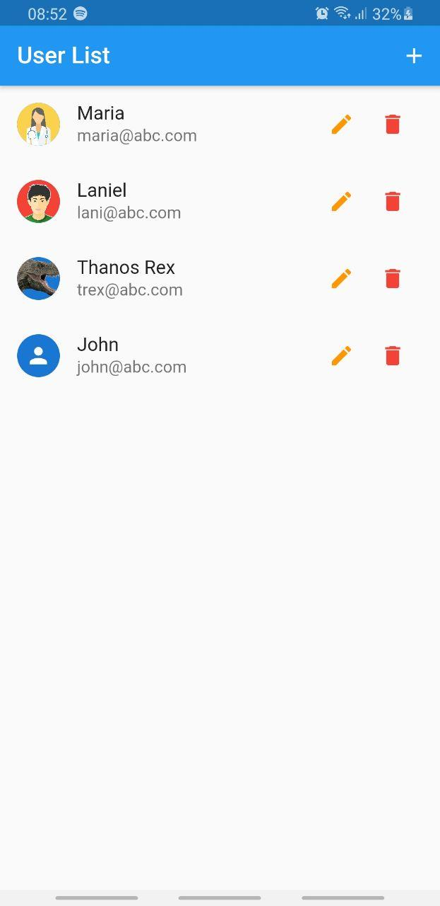
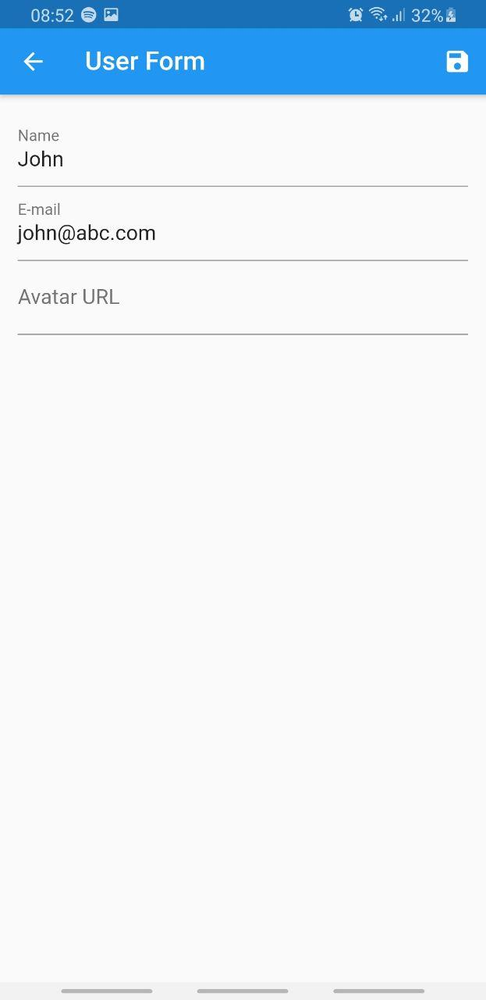
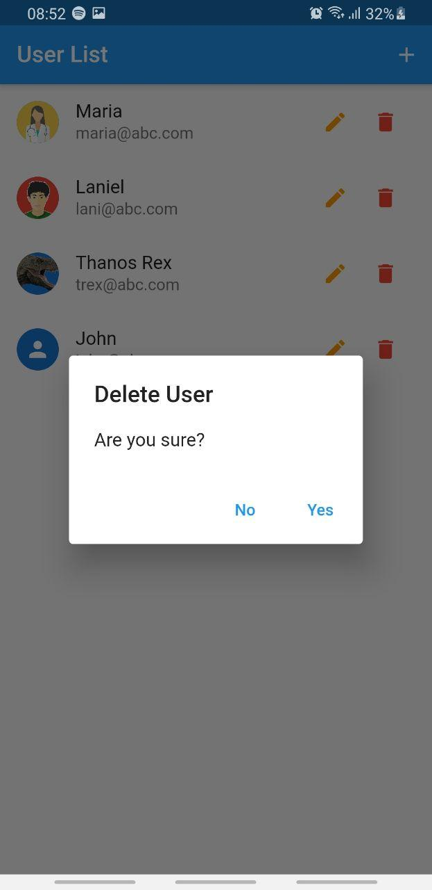

# User List with Flutter 🙍‍♀️🙍‍♂️📑

A simple CRUD of users, [implemented](https://www.youtube.com/watch?v=ViahqKZzZ7Y&list=WL&index=2&ab_channel=Cod3rCursos) in the youtube channel [Cod3r Cursos](https://www.youtube.com/channel/UCcMcmtNSSQECjKsJA1XH5MQ).

  
Screenshots

  <section>
    
    
    
  </section>

## Getting Started

This project is a starting point for a Flutter application.

A few resources to get you started if this is your first Flutter project:

- [Lab: Write your first Flutter app](https://flutter.dev/docs/get-started/codelab)
- [Cookbook: Useful Flutter samples](https://flutter.dev/docs/cookbook)

For help getting started with Flutter, view our
[online documentation](https://flutter.dev/docs), which offers tutorials,
samples, guidance on mobile development, and a full API reference.